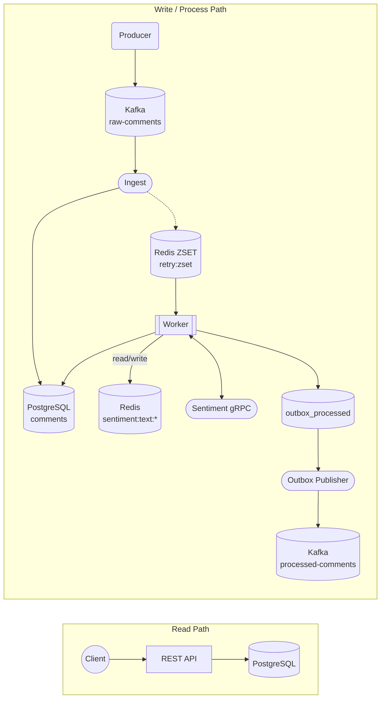

# Comment Processing Service


A reference implementation of a comment-ingestion pipeline that consumes raw events from Kafka, enriches each comment via an unreliable external gRPC sentiment service, persists the result in PostgreSQL, and republishes the enriched event back to Kafka through an outbox. The codebase shows how to make this kind of pipeline correct under duplicate, late, and out-of-order events, while remaining resilient to a downstream dependency that is rate-limited, slow, and randomly drops requests.

## Components

| Binary             | Command                  | Role                                                                                                  |
| ------------------ | ------------------------ | ----------------------------------------------------------------------------------------------------- |
| `producer`         | `cmd/producer`           | Generates lorem-ipsum comment events at a configurable rate with optional bursts.                     |
| `ingest`           | `cmd/ingest`             | Consumes `raw-comments`, deduplicates by `event_id`, upserts the comment, enqueues it for processing. |
| `worker`           | `cmd/worker`             | Pops due comments from the processing ZSET, calls the sentiment gRPC, writes result + outbox row.     |
| `outbox-publisher` | `cmd/outbox-publisher`   | Polls `outbox_processed`, publishes to `processed-comments`, marks rows published.                    |
| `api`              | `cmd/api`                | Read-only HTTP API (Fiber v3) for listing and fetching comments.                                      |
| `sentiment-grpc`   | `cmd/sentiment-grpc`     | Mock external sentiment service: deterministic per text, rate-limited, latency, random drops.         |

## Architecture



Solid edges are primary flow. The dashed `Ingest -.-> Redis ZSET` edge marks a fire-and-forget enqueue: the comment is durable in PostgreSQL once ingest commits, but if the ZSET write fails the comment will sit in `pending` until something resweeps it (re-ingest of the same `event_id` is deduplicated, so a periodic backfill of `pending` rows is the realistic recovery path). This trade-off is documented in *Trade-offs & Future Work*.

## Key Design Decisions

### 1. Outbox pattern for at-least-once publish from PostgreSQL to Kafka

The worker has to do two things when a comment is processed: update the row in PostgreSQL and publish the enriched event to Kafka. These cannot share a transaction. A naive dual-write fails in two directions:

- DB commit succeeds, Kafka publish fails → downstream consumers never see the processed event but the API serves it.
- Kafka publish succeeds, DB commit fails → downstream sees the event but the API contradicts it.

Instead, the worker writes the comment update **and** an `outbox_processed` row in a single PostgreSQL transaction (`MarkCommentProcessed` in `internal/repository/comments.go`). A separate `outbox-publisher` process polls unpublished rows, publishes them to Kafka, and marks them published. The publisher can crash and restart freely; rows that were sent but not marked simply get republished. This gives at-least-once delivery and pushes the burden of deduplication to consumers, which is the conventional contract for log-based pipelines.

### 2. ZSET-based retry queue with backoff and jitter

Retry scheduling lives in a single Redis sorted set (`retry:zset`) where the score is the next-attempt epoch in milliseconds and the member is the `comment_id`. A small Lua script (`retryLua` in `internal/worker/worker.go`) pops one due item atomically:

```
ZRANGEBYSCORE retry:zset -inf <now> LIMIT 0 1  →  ZREM
```

This avoids a scan-and-delete race between workers without a separate broker. Failures reschedule with `attempt = attempt+1`, capped exponential backoff (`BACKOFF_BASE * 2^(attempt-1)`, clipped to `BACKOFF_MAX`), plus uniform jitter up to `BACKOFF_JITTER`. The jitter is what matters at scale: a synchronized retry storm hits the gRPC rate limit on every cycle and never makes forward progress; the jitter spreads attempts out enough that some succeed.

`EnqueueRetry` in `internal/cache/cache.go` uses `ZADD NX` so a duplicate ingest of the same `comment_id` cannot clobber an already-scheduled future score with `now`.

### 3. Token-based distributed lock release

Before processing a comment the worker takes a Redis lock (`lock:comment:<id>`) via `SETNX <workerID>` with `LOCK_TTL`. Releasing the lock is **not** a plain `DEL` — that would race against TTL expiry, where a slow RPC lets the lock expire, another worker takes it, and the original worker's deferred `DEL` then deletes the new owner's lock. Instead, `releaseLockScript` (Lua, in `internal/worker/worker.go`) does a check-and-delete: it only deletes the key if its current value is still the caller's `workerID`.

If `SETNX` finds the lock already held, the worker re-enqueues the comment onto the retry ZSET with score `now + LockTTL` rather than dropping it. The new owner finishes (or its lock expires) by then, so the comment is picked up cleanly on the next pass.

A detailed walkthrough of this pattern, including the failure modes it prevents, is available in [the cache stampede article](https://muratgungor.dev/rediste-del-neden-tek-basina-yetmez-cache-stampede-ve-guvenli-lock-release).

### 4. Sentinel-based non-retryable error short-circuit

Some gRPC errors will never succeed on retry: `INVALID_ARGUMENT`, `PERMISSION_DENIED`, `UNAUTHENTICATED`, etc. Cycling through `MAX_ATTEMPTS` of those is wasted work and pollutes `attempt_count`. The worker classifies errors via `isRetryableRPC` — only `RESOURCE_EXHAUSTED`, `UNAVAILABLE`, and `DEADLINE_EXCEEDED` are retryable — and wraps the rest in a private `nonRetryableError` sentinel. `markFailure` checks the sentinel via `errors.As` and short-circuits to `MarkAsTerminallyFailed`, which sets `status = 'failed'` without incrementing `attempt_count` or scheduling a retry.

### 5. Idempotency via Redis `event_id` markers

The ingest path deduplicates exact event repeats with `idem:event:<event_id>` markers (`SETNX` with `IDEMPOTENCY_TTL`). The order is deliberately marker-first, then DB upsert: if the marker is set we drop the message, otherwise we proceed. The contract upstream is that `event_id` is unique per emitted event (the producer assigns a fresh UUID per message), so the marker reliably distinguishes a Kafka redelivery from a genuinely new event for the same `comment_id`.

This carries one narrow trade-off worth being explicit about. If the process dies in the window between `SetNX` returning `true` and the DB upsert committing, the marker exists but the row does not, and the event is silently skipped on redelivery. The window is small (microseconds in practice) and the system is intended for at-least-once Kafka semantics where loss is statistically tolerable, but the failure mode is real. On DB upsert failure the ingest path calls `UnmarkEvent` to release the marker so a retry can succeed; only an outright crash leaves the marker orphaned.

Out-of-order safety is enforced separately at the SQL layer: `UpsertComment` only overwrites when the incoming `event_time` is strictly newer (`WHERE EXCLUDED.event_time > comments.event_time`).

### 6. Single-instance outbox publisher

The outbox publisher's `FetchOutboxBatch` query selects unpublished rows by `published_at IS NULL ORDER BY created_at LIMIT n` — there is no `FOR UPDATE SKIP LOCKED`. Two publisher instances running concurrently would fetch overlapping batches and double-publish. **Run exactly one publisher instance.** This is a real constraint of the current implementation, not a feature; lifting it is listed in *Trade-offs & Future Work*.

## Quick Start

### Option A — Everything in Docker

```bash
docker compose -f deploy/docker-compose.full.yml up --build
```

This brings up PostgreSQL, Redis, Redpanda, the migration job, all six service binaries, and Dozzle for log inspection.

- REST API: `http://localhost:8080`
- Dozzle (logs): `http://localhost:8088`

### Option B — Infrastructure in Docker, services locally

```bash
docker compose -f deploy/docker-compose.yml up -d        # postgres, redis, redpanda
sql-migrate up -env=development                          # apply migrations

go run ./cmd/sentiment-grpc &
go run ./cmd/ingest &
go run ./cmd/worker &
go run ./cmd/outbox-publisher &
go run ./cmd/api &

go run ./cmd/producer -interval=1s -size=24 -reuse-percent=20
```

Migrations are managed by [`sql-migrate`](https://github.com/rubenv/sql-migrate); the configuration lives in `dbconfig.yml`.

## API Reference

### `GET /comments`

Lists comments ordered by `event_time` descending.

| Query Param  | Type                                  | Default | Notes                            |
| ------------ | ------------------------------------- | ------- | -------------------------------- |
| `sentiment`  | `positive` \| `negative` \| `neutral` | —       | Optional exact match.            |
| `status`     | `pending` \| `processed` \| `failed`  | —       | Optional exact match.            |
| `since`      | RFC3339 / RFC3339Nano                 | —       | Lower bound on `event_time`.     |
| `until`      | RFC3339 / RFC3339Nano                 | —       | Upper bound on `event_time`.     |
| `limit`      | int                                   | 50      | Capped at 200.                   |
| `offset`     | int                                   | 0       | Negative values clamped to 0.    |

```bash
curl "http://localhost:8080/comments?sentiment=negative&limit=50"
```

### `GET /comments/{commentId}`

Returns a single comment or `404` with `{"error":"not found"}`.

Response shape:

```json
{
  "commentId": "CMT-123",
  "text": "Lorem ipsum...",
  "sentiment": "positive",
  "status": "processed",
  "eventTime": "2026-05-02T10:00:00Z",
  "processedAt": "2026-05-02T10:00:02Z"
}
```

`sentiment` and `processedAt` are omitted when null.

## Deep Dives

### Event schemas

`raw-comments` (input):

```json
{
  "event_id": "uuid",
  "event_time": "2026-05-02T10:00:00Z",
  "comment_id": "CMT-123",
  "text": "Lorem ipsum..."
}
```

`processed-comments` (output):

```json
{
  "comment_id": "CMT-123",
  "event_id": "uuid",
  "event_time": "2026-05-02T10:00:00Z",
  "text": "Lorem ipsum...",
  "sentiment": "positive|negative|neutral",
  "processed_at": "2026-05-02T10:00:02Z"
}
```

Kafka message key is `comment_id` on both topics, so all events for a given comment land on the same partition and preserve per-comment ordering.

### Data model

`comments`:

| Column          | Type                | Notes                                                          |
| --------------- | ------------------- | -------------------------------------------------------------- |
| `comment_id`    | `TEXT PRIMARY KEY`  | Stable identifier across event repeats.                        |
| `event_id`      | `TEXT NOT NULL`     | Last-write-wins; replaced when a newer `event_time` arrives.   |
| `event_time`    | `TIMESTAMPTZ`       | Drives out-of-order suppression in `UpsertComment`.            |
| `text`          | `TEXT`              | Latest text for the comment.                                   |
| `text_hash`     | `TEXT`              | SHA-256 of `text`; keys the sentiment cache.                   |
| `sentiment`     | `TEXT NULL`         | Set by the worker on success.                                  |
| `status`        | `TEXT`              | `pending` \| `processed` \| `failed`.                          |
| `attempt_count` | `INT`               | Incremented only on retryable failures.                        |
| `last_error`    | `TEXT NULL`         | Most recent failure cause; cleared on success.                 |
| `processed_at`  | `TIMESTAMPTZ NULL`  | Set in the same transaction as the outbox row.                 |

`outbox_processed`:

| Column             | Type                    | Notes                                            |
| ------------------ | ----------------------- | ------------------------------------------------ |
| `id`               | `BIGSERIAL PRIMARY KEY` | Order of insertion = order of publish attempts.  |
| `comment_id`       | `TEXT`                  |                                                  |
| `payload_json`     | `JSONB`                 | Marshalled `processed-comments` event.           |
| `topic`            | `TEXT`                  | Defaults to `processed-comments`.                |
| `publish_attempts` | `INT`                   | Bumped on each publish failure; observational only — does not gate retries. |
| `last_error`       | `TEXT NULL`             |                                                  |
| `published_at`     | `TIMESTAMPTZ NULL`      | Sentinel for "delivered to Kafka".               |

### Outbox lifecycle

1. Worker enriches the comment, then in one PostgreSQL transaction:
   - `UPDATE comments SET sentiment, status='processed', processed_at, …`
   - `INSERT INTO outbox_processed (comment_id, payload_json, topic) …`
2. Outbox publisher loops every `LOOP_INTERVAL`:
   - `SELECT … WHERE published_at IS NULL ORDER BY created_at LIMIT BATCH_SIZE`
   - For each row: `WriteMessages` to Kafka, then either `MarkOutboxPublished` or `MarkOutboxPublishError` (which bumps `publish_attempts` and stores the error).
3. Failed publishes are picked up again on the next iteration. `publish_attempts` is recorded for observability but does not gate retries — there is no per-row backoff (see *Trade-offs*).

### Worker retry / lock / cache state machine

1. **Pop**: atomic Lua `ZRANGEBYSCORE … ZREM` against `retry:zset`.
2. **Lock**: `SETNX lock:comment:<id> = workerID` with `LOCK_TTL`. If the lock is held by another worker, re-enqueue with score `now + LockTTL` and continue.
3. **Load**: read `comments` row; bail out if `status = 'processed'` (idempotent re-entry after a crash mid-publish).
4. **Cache**: `GET sentiment:text:<text_hash>`. Hit → use; miss → continue.
5. **Rate-limit**: `golang.org/x/time/rate` token bucket sized by `RPC_RATE_LIMIT`.
6. **gRPC**: `Analyze` with `RPC_TIMEOUT`. Classify error via `isRetryableRPC`.
7. **Persist**: on success, transactional `MarkCommentProcessed` writes the comment update **and** the outbox row. Cache the label.
8. **Failure**: `RecordRetryableFailure` increments `attempt_count`; if `attempt_count >= MAX_ATTEMPTS`, status flips to `failed` and the comment is not re-enqueued. Otherwise it is rescheduled with backoff + jitter.
9. **Release**: deferred Lua check-and-delete of the lock keyed on `workerID`.

## Configuration

All services load `.env` automatically (via `godotenv`). Sane defaults are baked in for local development; only `DATABASE_URL` is strictly required.

### PostgreSQL

| Var            | Default | Used by                                       |
| -------------- | ------- | --------------------------------------------- |
| `DATABASE_URL` | —       | `api`, `ingest`, `worker`, `outbox-publisher` |

### Redis

| Var              | Default          | Used by                |
| ---------------- | ---------------- | ---------------------- |
| `REDIS_ADDR`     | `127.0.0.1:6379` | `ingest`, `worker`     |
| `REDIS_DB`       | `0`              | `ingest`, `worker`     |
| `REDIS_PASSWORD` | _empty_          | `ingest`, `worker`     |

### Kafka

| Var                     | Default              | Used by                                  |
| ----------------------- | -------------------- | ---------------------------------------- |
| `KAFKA_BROKERS`         | `127.0.0.1:9092`     | `producer`, `ingest`, `outbox-publisher` |
| `KAFKA_TOPIC`           | `raw-comments`       | `producer`, `ingest`                     |
| `KAFKA_GROUP_ID`        | `comment-ingest`     | `ingest`                                 |
| `KAFKA_PROCESSED_TOPIC` | `processed-comments` | `outbox-publisher`                       |

### gRPC sentiment client

| Var                   | Default            | Used by  |
| --------------------- | ------------------ | -------- |
| `SENTIMENT_GRPC_ADDR` | `127.0.0.1:50051`  | `worker` |

### Worker

| Var               | Default      | Notes                                                       |
| ----------------- | ------------ | ----------------------------------------------------------- |
| `WORKER_ID`       | `worker-1`   | Identifies the lock owner; must be unique per instance.     |
| `MAX_ATTEMPTS`    | `10`         | Retry cap before a comment is marked `failed`.              |
| `BACKOFF_BASE`    | `200ms`      | Base of `BASE * 2^(attempt-1)`, capped by `BACKOFF_MAX`.    |
| `BACKOFF_MAX`     | `30s`        | Backoff ceiling.                                            |
| `BACKOFF_JITTER`  | `200ms`      | Uniform jitter added on top of the backoff.                 |
| `LOCK_TTL`        | `30s`        | Per-comment lock lifetime.                                  |
| `RETRY_ZSET`      | `retry:zset` | Shared between `ingest` and `worker` via `config.Load()`.   |
| `TEXT_CACHE_TTL`  | `168h`       | Sentiment cache TTL (7 days).                               |
| `RPC_RATE_LIMIT`  | `100`        | Token bucket size and refill rate (req/s).                  |
| `RPC_TIMEOUT`     | `2s`         | Per-call deadline on `Analyze`.                             |

### Ingest

| Var                | Default | Notes                                    |
| ------------------ | ------- | ---------------------------------------- |
| `IDEMPOTENCY_TTL`  | `24h`   | TTL on `idem:event:<event_id>` markers.  |

### Outbox publisher

| Var             | Default | Notes                                |
| --------------- | ------- | ------------------------------------ |
| `BATCH_SIZE`    | `100`   | Rows per polling iteration.          |
| `LOOP_INTERVAL` | `200ms` | Sleep between iterations.            |

### HTTP API

| Var        | Default | Used by |
| ---------- | ------- | ------- |
| `API_ADDR` | `:8080` | `api`   |

### Producer

CLI flags (not env vars):

| Flag             | Default | Notes                                                                |
| ---------------- | ------- | -------------------------------------------------------------------- |
| `-interval`      | `1s`    | Base inter-message delay (jittered ±20%).                            |
| `-size`          | `24`    | Approximate words per generated comment.                             |
| `-reuse-percent` | `20`    | Probability (0–100) of reusing recent text to exercise the sentiment cache. |

Plus env vars:

| Var                       | Default | Notes                                            |
| ------------------------- | ------- | ------------------------------------------------ |
| `PRODUCER_BURST_PERCENT`  | `10`    | Per-iteration chance of starting a burst.        |
| `PRODUCER_BURST_INTERVAL` | `100ms` | Inter-message delay during a burst.              |
| `PRODUCER_BURST_COUNT`    | `20`    | Messages per burst.                              |

## Tests

```bash
go test ./...
```

Current coverage is a small foothold of pure-function unit tests on the controller layer (`internal/controller/comments_test.go`) — `parseInt`, `parseTime`, and the `repository.Comment → CommentResponse` mappers. There are no integration tests for `ingest`, `worker`, or `outbox-publisher` yet; see *Trade-offs*.

## Trade-offs & Future Work

- **No integration tests for the pipeline.** The retry/lock/outbox logic is exercised only by running the system. Adding testcontainers-backed tests for ingest dedup, worker retry classification, and outbox lifecycle is the natural next step.
- **`grpc.NewClient` is lazy.** The worker no longer uses the deprecated `grpc.Dial`; `NewClient` defers the actual connection to the first RPC. A misconfigured `SENTIMENT_GRPC_ADDR` therefore surfaces as the first comment's RPC error, not at startup. This is a deliberate trade-off in exchange for the v1 API.
- **Outbox publisher must run as a single instance.** `FetchOutboxBatch` does not lock rows; concurrent publishers would double-publish. Switching to `FOR UPDATE SKIP LOCKED` lifts the constraint when horizontal publish scaling is actually needed.
- **Idempotency marker is written before the DB upsert.** A crash between `SetNX` and `UpsertComment` orphans the marker and silently skips the event on redelivery. The window is small and the upsert path calls `UnmarkEvent` on error, but the failure mode exists. A two-phase mark (claim then commit) would close it at the cost of more Redis traffic.
- **`RecordRetryableFailure` followed by `ZADD` is two non-atomic writes.** Process death between them leaves the comment `pending` with no retry entry, requiring a manual sweep or re-ingest. Fixing this with outbox-style atomicity here would be over-engineering for a transient operational risk.
- **Ingest → ZSET enqueue is fire-and-forget.** If the ZSET write fails after the DB upsert has committed, the comment is durable but never picked up by a worker. The mitigation is operational rather than structural: a periodic sweep of `pending` rows older than `MAX_BACKOFF` would re-enqueue them. The narrower fix is making the enqueue part of the same transaction via a small inbox table on PostgreSQL — the same idea as the outbox, applied to the read side.
- **Outbox publisher has no per-row backoff.** A Kafka outage means each iteration of the publish loop hits the broker at `LOOP_INTERVAL`. Adding a `next_attempt_at` column on `outbox_processed` and selecting on it would let the publisher back off without coordinating across instances.