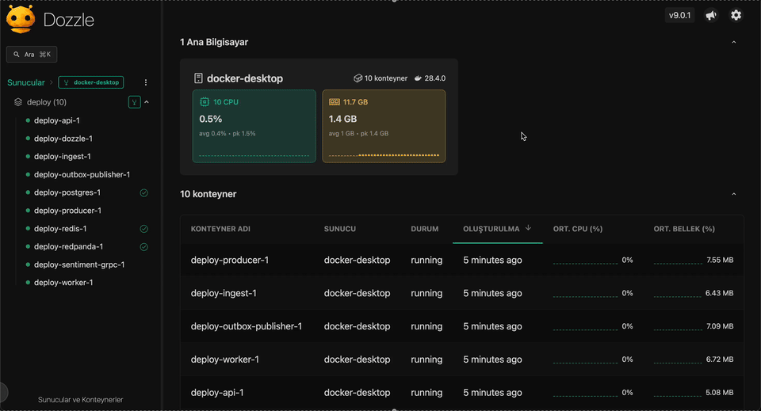

# Comment Processing Service

A small, production-ish demo system that ingests **raw user comments** from Kafka, enriches them via an **external (unreliable) gRPC sentiment service**, stores results in **PostgreSQL**, republishes **processed events** back to Kafka, and exposes a **REST API** for querying/filtering comments.

It’s designed to behave well under “real world” conditions:

* **Duplicate events**
* **Out-of-order / late events**
* gRPC dependency that is **rate-limited**, **slow**, and sometimes **drops** requests
* Reliable “DB update + Kafka publish” via an **Outbox** pattern
* Retry with **backoff + jitter**, plus text-level caching in Redis

---

## Architecture

```
                        ┌───────────────────────────────┐
                        │           Producer            │
                        │  (variable rate comment gen)  │
                        └───────────────┬───────────────┘
                                        │
                                        v
┌──────────────────────────────────────────────────────────────────────────┐
│                               Kafka (Redpanda)                           │
│                                                                          │
│   raw-comments topic                 processed-comments topic            │
│  ┌──────────────────┐              ┌───────────────────────┐           │
│  │ comment events    │              │ enriched comment evts  │           │
│  └─────────┬─────────┘              └───────────┬───────────┘           │
└────────────┼────────────────────────────────────┼────────────────────────┘
             │                                    │
             v                                    v
┌───────────────────────────┐              ┌───────────────────────────┐
│        Ingest Service      │              │        Downstream         │
│ (Kafka consumer: raw ingest│              │ (optional consumers)      │
│  + DB upsert + enqueue)    │              └───────────────────────────┘
└───────────────┬───────────┘
                │
     (enqueue work / retries)
                │
                v
┌──────────────────────────────────────────────────────────────────────────┐
│                                  Redis                                   │
│  idempotency(event_id)  sentiment_cache(text_hash)  retry_queue(ZSET)    │
└───────────────┬───────────────────────────────────────────┬──────────────┘
                │                                           │
                v                                           │
┌───────────────────────────┐                               │
│     Sentiment Workers      │<------------------------------┘
│ (rate-limited gRPC calls,  │
│  update DB, outbox write)  │
└───────────────┬───────────┘
                │
                v
┌──────────────────────────────────────────────────────────────────────────┐
│                               PostgreSQL                                 │
│  comments (raw+status+sentiment)      outbox_processed (publish tasks)   │
└───────────────┬───────────────────────────────────────────┬──────────────┘
                │                                           │
                v                                           v
       ┌───────────────────┐                      ┌──────────────────────┐
       │     REST API       │                      │   Outbox Publisher   │
       │ GET /comments ...  │                      │ -> Kafka processed   │
       └───────────────────┘                      └──────────────────────┘

┌───────────────────────────┐
│  External gRPC Sentiment   │
│ (rate limit + random drop  │
│  + latency by text length) │
└───────────────────────────┘
```

---

## Components

* **producer** (`cmd/producer`)
  Generates lorem-like comment text at variable rates and publishes to `raw-comments`.

* **ingest** (`cmd/ingest`)
  Consumes `raw-comments`, performs **event_id idempotency**, upserts the comment into Postgres, and enqueues work into Redis retry ZSET.

* **worker** (`cmd/worker`)
  Pulls due jobs from Redis, calls the gRPC sentiment service under a **client-side rate limiter**, caches sentiment by `text_hash`, updates Postgres, and writes to **outbox**.

* **outbox-publisher** (`cmd/outbox-publisher`)
  Reads Postgres outbox rows, publishes to Kafka `processed-comments`, and marks outbox rows as published.

* **api** (`cmd/api`)
  REST API for listing/filtering comments from Postgres.

* **sentiment-grpc** (`cmd/sentiment-grpc`)
  A mock “external” gRPC service:

  * deterministic result per text
  * latency based on text length
  * global rate limit (e.g., 100 req/s)
  * random drops

---

## Kafka topics & event schema

### `raw-comments` (input)

```json
{
  "event_id": "uuid",
  "event_time": "2025-12-01T10:00:00Z",
  "comment_id": "CMT-123",
  "text": "Lorem ipsum..."
}
```

### `processed-comments` (output)

```json
{
  "comment_id": "CMT-123",
  "event_id": "uuid",
  "event_time": "2025-12-01T10:00:00Z",
  "text": "Lorem ipsum...",
  "sentiment": "positive|negative|neutral",
  "processed_at": "2025-12-01T10:00:02Z"
}
```

**Recommended message key**: `comment_id`.

---

## Storage model (PostgreSQL)

### `comments`

Stores the serving view + workflow status.

Typical fields:

* `comment_id` (PK)
* `event_id`, `event_time`
* `text`, `text_hash`
* `sentiment` (nullable)
* `status`: `pending|processed|failed`
* `attempt_count`, `last_error`
* `processed_at`, `created_at`, `updated_at`

**Out-of-order safety**: ingest upsert should only overwrite if the incoming `event_time` is **newer** than what’s stored.

### `outbox_processed`

Ensures reliable publishing to Kafka (`processed-comments`).

Typical fields:

* `id` (PK)
* `comment_id`
* `payload_json`
* `topic`
* `publish_attempts`, `last_error`
* `created_at`, `published_at` (nullable)

---

## Redis usage

Redis is used for **processing correctness and throughput**:

1. **Idempotency** (exact duplicates)
   `processed:event:{event_id}` = `1` (TTL e.g., 24h)

2. **Text-level sentiment cache**
   `sentiment:text:{text_hash}` = `positive|negative|neutral` (TTL e.g., 7d)

3. **Retry queue (delayed jobs)**
   ZSET `retry:zset` where:

* member = `comment_id`
* score = `next_attempt_epoch_ms`

---

## Retry & backoff (worker)

The gRPC service can:

* rate limit (`RESOURCE_EXHAUSTED`)
* drop (`UNAVAILABLE`)
* be slow (latency by text length)

Worker strategy:

* On failure: `attempt_count++`, store `last_error`, reschedule into `retry:zset` with:

  * exponential backoff (capped)
  * **jitter** (random small delay) to avoid synchronized retry storms
* After `MAX_ATTEMPTS`: mark comment as `failed` (optional DLQ later)

---

## Why the Outbox pattern?

Publishing to Kafka and updating Postgres cannot be done in a single transaction. Without outbox you can end up with:

* DB updated but Kafka publish failed → downstream misses the processed event
* Kafka published but DB update failed → REST returns stale data

With outbox:

* Worker commits (DB update + outbox row) atomically in Postgres
* Publisher reliably sends outbox rows to Kafka, retrying on failure

This gives **at-least-once** delivery for `processed-comments` and prevents message loss.

---

## Running the project

### Option A — Full Docker (everything containerized)

```bash
docker compose -f deploy/docker-compose.full.yml up --build
```

* REST API: `http://localhost:8080`
* Dozzle (logs UI): `http://localhost:8088`



### Option B — Infra in Docker, apps locally

```bash
docker compose -f deploy/docker-compose.yml up -d
```

Then run each binary (examples):

```bash
go run ./cmd/migrate

go run ./cmd/ingest
go run ./cmd/worker
go run ./cmd/outbox-publisher
go run ./cmd/api

go run ./cmd/producer -interval=1s -size=24 -reuse-percent=20
```


## REST API

### List comments

`GET /comments`

Common query params:

* `sentiment=positive|negative|neutral` (optional)
* `status=pending|processed|failed` (optional)
* `since=RFC3339` / `until=RFC3339` (optional)
* `limit` (default 50) and `offset`

Example:

```bash
curl "http://localhost:8080/comments?sentiment=negative&limit=50"
```

### Get one comment

`GET /comments/{commentId}`

---

## Configuration

Typical env vars:

* `DATABASE_URL`
* `REDIS_ADDR`, `REDIS_DB`
* `KAFKA_BROKERS`
* `KAFKA_TOPIC` (raw-comments)
* `KAFKA_PROCESSED_TOPIC` (processed-comments)
* `KAFKA_GROUP_ID`
* `SENTIMENT_GRPC_ADDR`
* `API_ADDR`

See `internal/config/` for the full set and defaults.

---

## Key design decisions & trade-offs

### Split ingest and worker

**Why:** keep Kafka consumption stable and avoid blocking on external gRPC calls.
**Trade-off:** more moving parts (queue + worker).

### Redis sentiment cache by `text_hash`

**Why:** same text can appear under different `comment_id`s; gRPC is expensive/rate-limited.
**Trade-off:** TTL tuning matters; relies on sentiment service determinism.

### Outbox pattern

**Why:** reliable DB + Kafka publishing without dual-write inconsistency.
**Trade-off:** at-least-once semantics → downstream must be idempotent.

### ZSET retry queue + backoff + jitter

**Why:** smooth retries under drops/rate limiting without synchronized storms.
**Trade-off:** requires atomic “pop due job” logic (Lua or equivalent).

---

## Future improvements

* **PostgreSQL + ClickHouse (optional analytics read model)**
  If you later introduce **numeric ratings** (e.g., 1–5 stars) and/or need more **analytics-heavy** queries, you can evolve into a split design:

  * **PostgreSQL** remains the source of truth for workflow/job management (status, retries, outbox).
  * A separate consumer ingests `processed-comments` into **ClickHouse** for fast analytics and time-series queries.

  Examples of queries that become very natural (and fast) with ClickHouse:

  * **Time-series sentiment + rating trend**

    * “Hourly average rating + sentiment counts for the last 7 days”
    * “Rolling 7-day average rating, broken down by sentiment”

  * **Top-N / worst-N slices**

    * “Top 10 hours with the highest negative sentiment share”
    * “Days where average rating dropped the most vs. the previous day”

  * **Operational analytics**

    * “Processing latency percentiles (`processed_at - event_time`) over time”
    * “Retry/failure rate per hour (correlate with gRPC drops/rate limits)”

---

## Testing

```bash
go test ./...
```
